# CarCombat-3D-Game

### Update: 
#### - Large files are now tracked using git-lfs
#### - DeLorean full car model with gun mounted on. Gun control using mouse, car control through keyboard. Settings can be changed from within the game itself.
#### - Game is now complete with time constraints, 15+ turrets, hazardous elements on the map

### Cab combat game being built using Unreal engine utilising c++ and blueprints. The objective of the game is to avoid hazards scattered across the map such as lava, river, land mines, while destroying the turrets present at different locations.

### The game is currently under development

# Screenshots

### Playable map
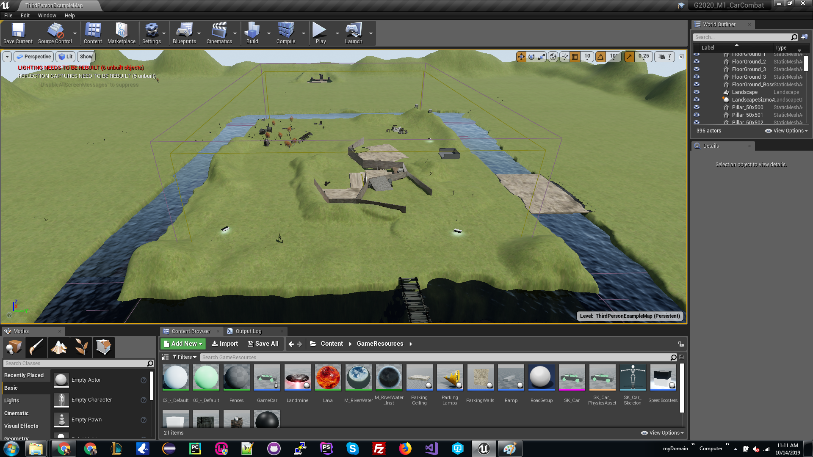

### Playable map - Map 1
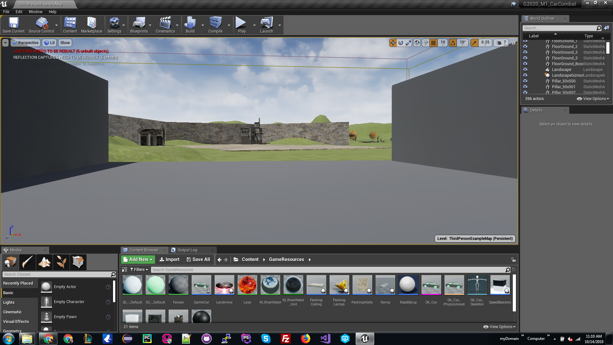

### Playable map - Map 2
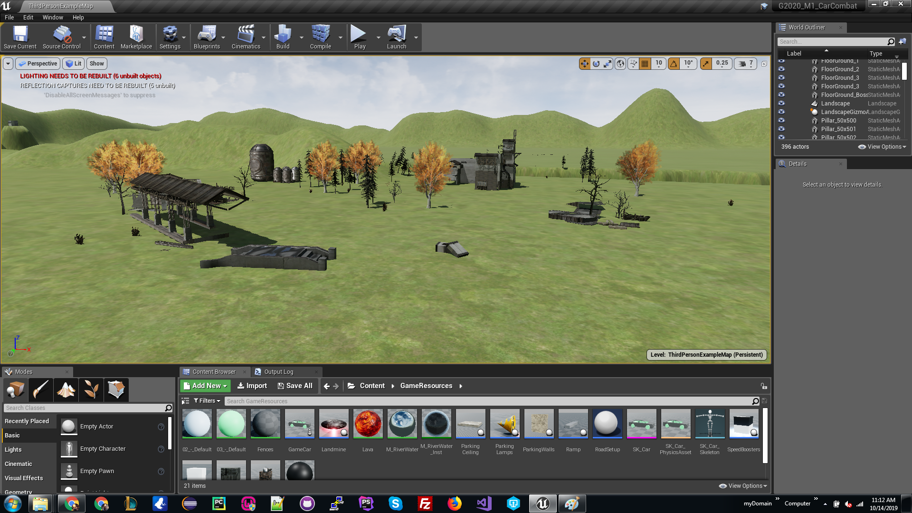

### Playable map - Map 3

### Playable map - Underground Entrance
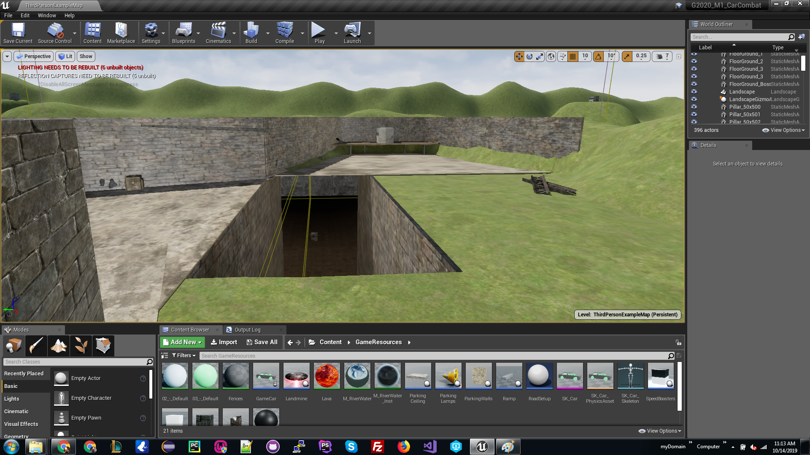

### Playable map - Underground 1
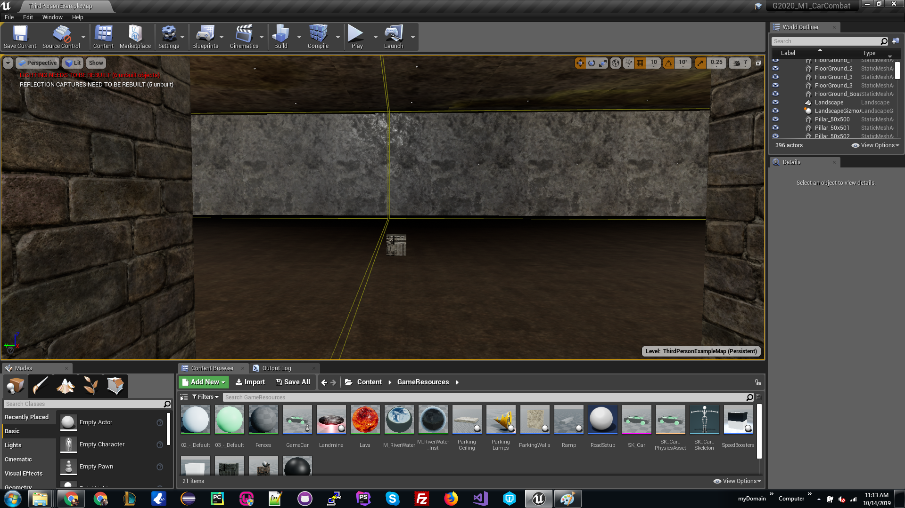

### Playable map - Underground 2
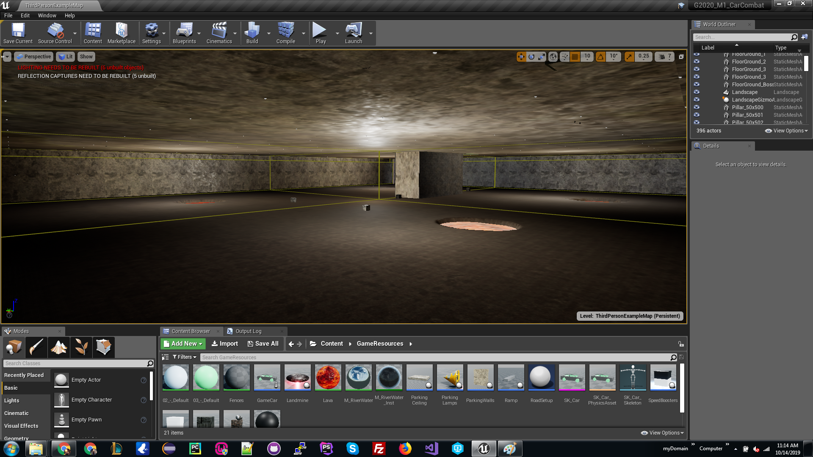

### Playable map - Underground 3
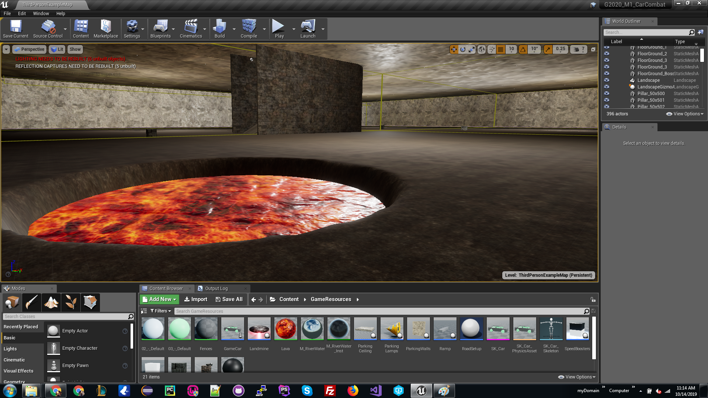

### Playable map - Underground 4
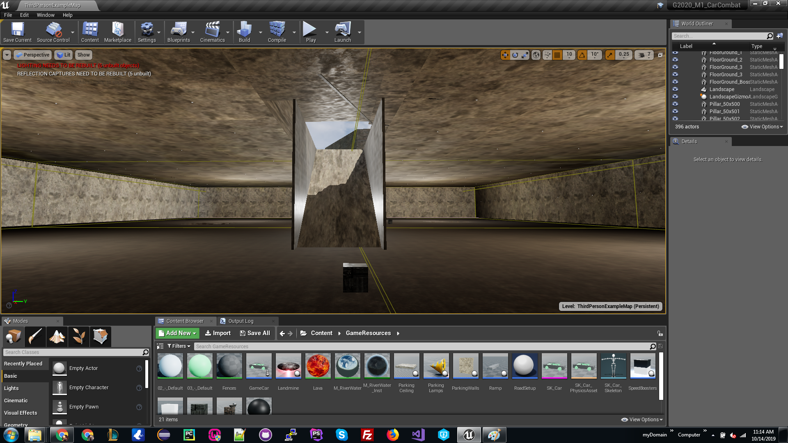

### Player - Car Model
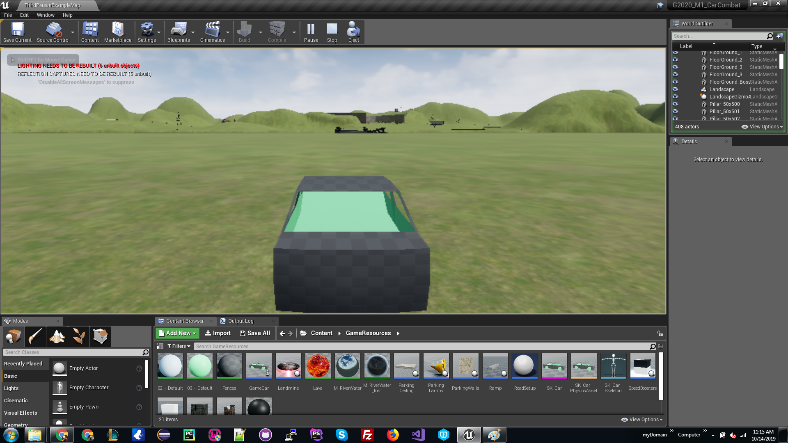

### Playable map - Gameplay
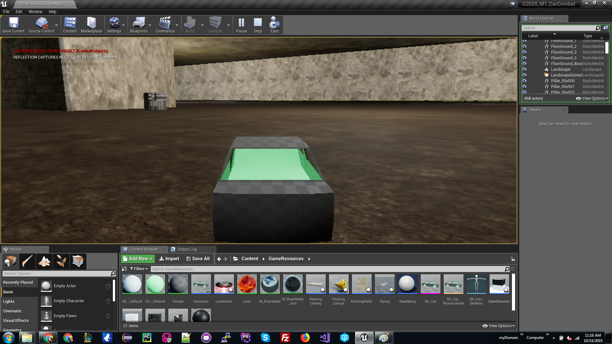

### Playable map - River
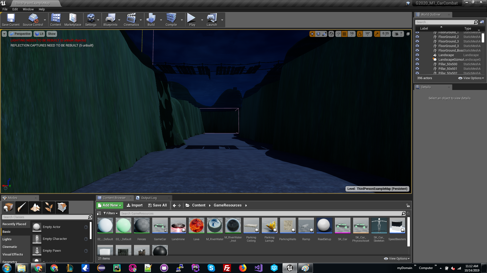

### Game - Car Model
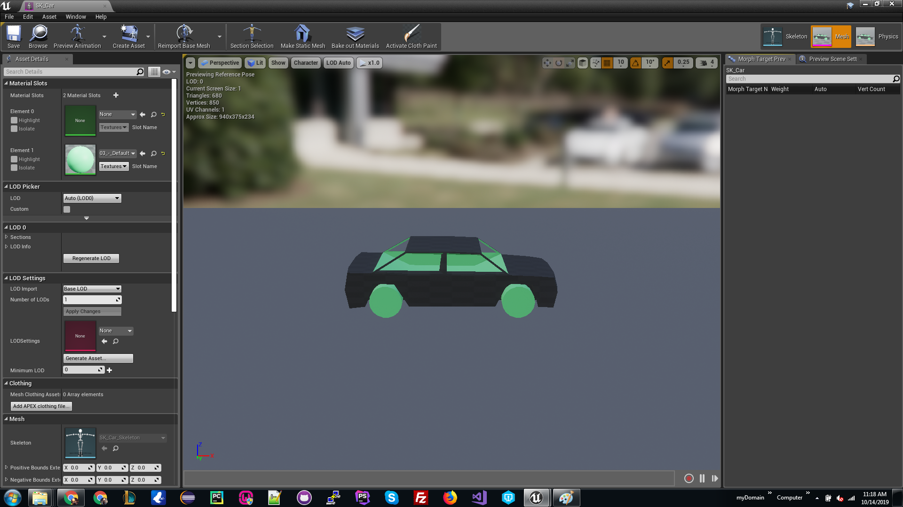

### Game - Car Model
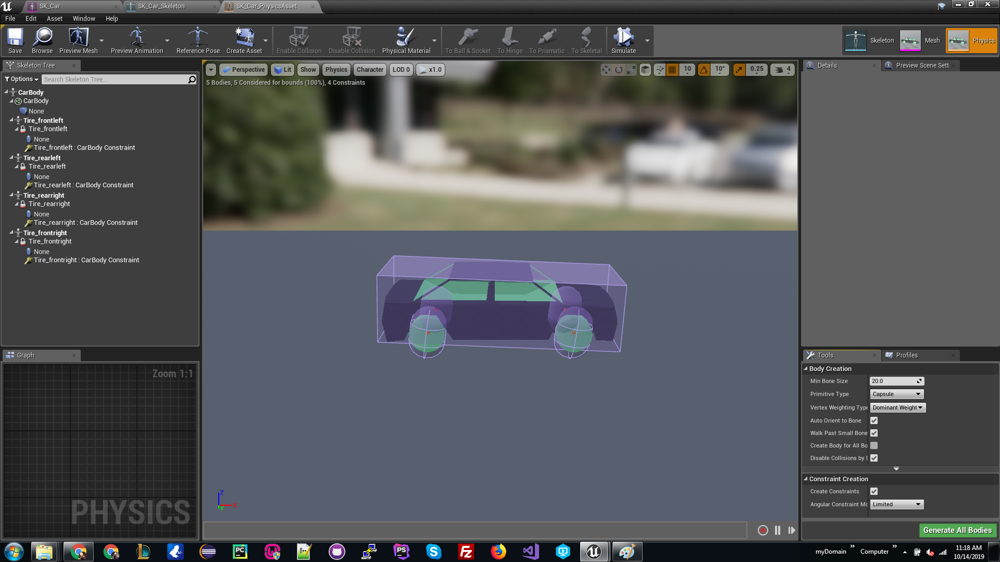

### Game - Car Model
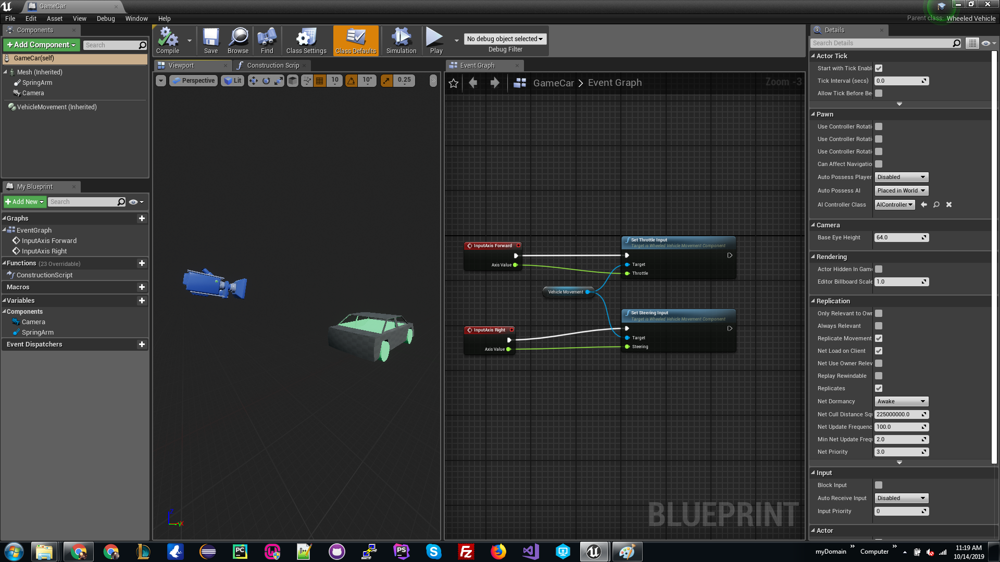

### Material Blueprint
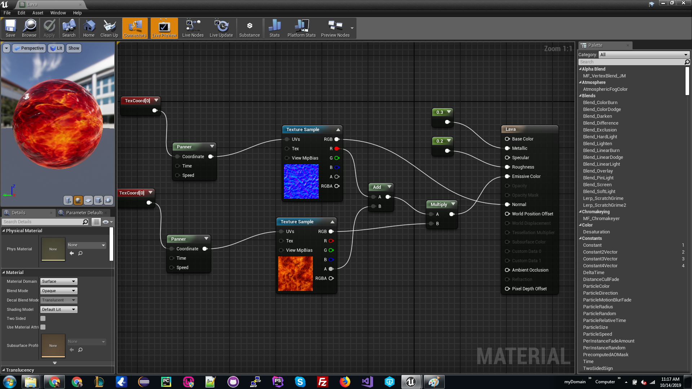

### Material Blueprint 2

